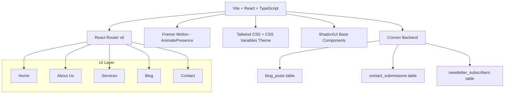

## Objective
Build a cinematic, dark-mode-first agency website for **Pixel Live Production** with 5 pages, 3D parallax effects, Framer Motion page transitions, Convex backend, and a light/dark theme toggle. Stack: **Vite + React + TypeScript + Tailwind CSS v3 + Framer Motion + React Router v6 + Convex + Shadcn/UI base**.

---

## Architecture Overview



---

## Phase 1 — Project Scaffold & Config

**Target files:** `package.json`, `vite.config.ts`, `tailwind.config.ts`, `index.html`, `src/main.tsx`, `src/App.tsx`

- Init Vite project: `npm create vite@latest . -- --template react-ts`
- Install dependencies:
  - `framer-motion` — animations & page transitions
  - `react-router-dom` — routing
  - `convex` — backend client
  - `@radix-ui/react-*` — Shadcn primitives (dialog, dropdown, tabs, tooltip)
  - `clsx`, `tailwind-merge`, `class-variance-authority` — utility classname helpers
  - `lucide-react` — icon set
  - `@fontsource/geist`, `@fontsource/inter` — self-hosted fonts (zero CLS)
  - `three` + `@react-three/fiber` + `@react-three/drei` — 3D hero elements (optional globe/particle mesh)
  - `sonner` — toast notifications for form feedback
- Configure **Tailwind v3** with:
  - CSS variable–based color tokens (`--color-neon`, `--color-bg`, etc.)
  - `darkMode: 'class'`
  - `fontFamily: { sans: ['Geist', 'Inter', ...] }`
  - Custom `animate-*` utilities for beam, sparkle, marquee
- Configure **path aliases** in `vite.config.ts`: `@/` → `src/`

---

## Phase 2 — Theme System

**Target files:** `src/lib/theme.ts`, `src/components/providers/ThemeProvider.tsx`, `tailwind.config.ts`

- `ThemeProvider` wraps the app, persists `dark`/`light` in `localStorage`, adds/removes `dark` class on `<html>`
- CSS variables defined in `index.css` under `:root` (light) and `.dark` — covers backgrounds, foregrounds, neon accent (`#00F0FF`), muted, border, glass layers
- `useTheme()` hook exported for toggle button

---

## Phase 3 — Layout Shell & Navigation

**Target files:** `src/components/layout/Navbar.tsx`, `src/components/layout/Footer.tsx`, `src/App.tsx`

### Navbar
- **Floating glassmorphic** bar: `backdrop-blur-md bg-black/30 dark:bg-white/5 border border-white/10`
- Logo: stylized text "PIXEL LIVE" with neon `#00F0FF` accent dot / underline
- Nav links with animated underline on hover (Framer Motion `layoutId` shared underline)
- Dark/Light toggle button (moon ↔ sun icon, animated with `motion.div` rotate)
- CTA button: "Get Started" with neon border glow

### Footer
- Dark full-width with subtle grid texture
- Three columns: brand + tagline, nav links, social links
- Neon accent separator line

### App Shell (`App.tsx`)
- `<AnimatePresence mode="wait">` wrapping `<Routes>` with `key={location.pathname}`
- Each page wrapped in `<PageTransition>` component (`opacity` + `y` slide, 0.4s ease)

---

## Phase 4 — Reusable Custom UI Components

**Target directory:** `src/components/ui/`

These are custom-built Aceternity/Magic UI-inspired components:

| Component | File | Effect |
|---|---|---|
| `SpotlightCard` | `spotlight-card.tsx` | Mouse-tracked radial light follows cursor within card boundary |
| `TiltCard` | `tilt-card.tsx` | `rotateX/Y` on mousemove via Framer Motion, `perspective-1000` |
| `AnimatedBeam` | `animated-beam.tsx` | SVG path with animated gradient stroke connecting two elements |
| `BentoGrid` | `bento-grid.tsx` | CSS Grid with variable span cells, hover border-beam effect |
| `Marquee` | `marquee.tsx` | Infinite horizontal scroll via CSS `@keyframes` + `animation-play-state: paused` on hover |
| `NumberTicker` | `number-ticker.tsx` | Count-up animation triggered by `useInView` from Framer Motion |
| `TextGenerateEffect` | `text-generate.tsx` | Word-by-word fade-in stagger animation |
| `AuroraBackground` | `aurora-bg.tsx` | CSS conic-gradient animated mesh background |
| `BackgroundBeams` | `bg-beams.tsx` | SVG radial beams emanating from center, animated opacity |
| `BlurFadeIn` | `blur-fade.tsx` | `blur(8px) → 0` + opacity + Y translate on scroll enter |
| `GlassCard` | `glass-card.tsx` | `backdrop-blur`, `bg-white/5`, `border-white/10`, inner glow shadow |
| `BorderBeam` | `border-beam.tsx` | Animated conic gradient border that rotates around card |
| `FloatingNav` | `floating-nav.tsx` | Pills that float & highlight active route |
| `PageTransition` | `page-transition.tsx` | Wraps each page route with enter/exit variants |
| `OrbitingCircles` | `orbiting-circles.tsx` | SVG concentric orbits for hero visual interest |
| `ParticleField` | `particle-field.tsx` | Canvas-based subtle particle mesh (hero bg layer) |

---

## Phase 5 — Page Implementations

### 5A — Home Page (`src/pages/Home.tsx`)

**Sections (top → bottom):**

1. **Hero Section**
   - Full-viewport dark background layered: `ParticleField` (base) → `AuroraBackground` (mid) → `BackgroundBeams` (top)
   - Z-axis parallax: 3 layers scroll at different speeds via `useScroll` + `useTransform`
   - Masked video background option: `<video autoPlay muted loop>` with `mix-blend-mode: screen` behind glass headline
   - Headline: `TextGenerateEffect` → "We Build Worlds. **You Conquer Them.**"
   - Sub-copy fade in at 0.6s delay
   - Two CTA buttons: "View Our Work" (neon fill) + "Talk to Us" (ghost)
   - Scroll indicator: animated chevron with bounce

2. **Mission Control Dashboard** (Services preview)
   - Section header: `BlurFadeIn`
   - `BentoGrid` layout with 5 service cards using `SpotlightCard`:
     - Video Production (spans 2 cols), SEO, SEM, Ads, Content Planning
   - Each card: icon + title + one-liner + neon tag + hover `BorderBeam`

3. **Stats Bar**
   - 4 `NumberTicker` counters: Projects Delivered, Clients, Views Generated, Years
   - Horizontal dividers with neon glow

4. **Client Logo Strip**
   - `Marquee` component (two rows, opposite directions)

5. **Featured Work** (3 `TiltCard` with project images, overlay on hover)

6. **Testimonials**
   - Animated testimonial cards with avatar, quote, role — stagger entrance

7. **CTA Banner**
   - Full-width `AuroraBackground` section with centered headline + button

---

### 5B — About Us (`src/pages/About.tsx`)

- **Horizontal scroll storytelling** via `useScroll` + `useTransform` mapped to `x` translate — panels slide left as user scrolls vertically (sticky container technique)
- 5 horizontal panels:
  1. "Our Origin" — founding story with `AnimatedBeam` connecting founder avatars
  2. "Our Philosophy" — 3 `GlassCard` pillars
  3. "Our Team" — `TiltCard` grid with team members
  4. "Our Process" — `OrbitingCircles` with process steps
  5. "Our Numbers" — `NumberTicker` stats
- `TracingBeam` side indicator shows scroll progress through panels

---

### 5C — Services (`src/pages/Services.tsx`)

- Hero: `SpotlightCard` full-width banner per service category
- 4 service sections (Video, Search, Ads, Content) each with:
  - Large `TiltCard` 3D module: icon, title, description, feature list, CTA
  - `AnimatedBeam` connecting service to outcome visual
  - Alternate left/right layout with `BlurFadeIn`
- Bottom: `BentoGrid` with micro-features (deliverables, tools used)

---

### 5D — Blog (`src/pages/Blog.tsx`)

- **Bento-box grid** layout: featured post (large, 2-col), then 3-col grid
- Posts fetched via `useQuery(api.blog.listPublished)` from Convex in real-time
- Each card: thumbnail, category tag (neon), title, excerpt, read time, author avatar
- `BlurFadeIn` stagger on card mount
- Category filter tabs (All / Video / SEO / Ads / Content) — animated active pill
- Single post route: `src/pages/BlogPost.tsx` — full article with `TracingBeam` progress

---

### 5E — Contact (`src/pages/Contact.tsx`)

- **Glassmorphic floating form** centered on `BackgroundBeams` background
- `GlassCard` container: `backdrop-blur-xl bg-white/5 border border-white/10`
- Form fields: Name, Email, Company, Service Interest (select), Message
- All fields with neon focus ring animation (`border-[#00F0FF]`)
- Submit calls `useMutation(api.contact.submit)` → saves to Convex → `sonner` toast
- Newsletter opt-in checkbox → `useMutation(api.newsletter.subscribe)`
- Right panel (desktop): `OrbitingCircles` with service icons + social links

---

## Phase 6 — Convex Backend

**Target directory:** `convex/`

### Schema (`convex/schema.ts`)
```
blog_posts: { title, slug, excerpt, content, category, author, publishedAt, coverImage, published }
contact_submissions: { name, email, company, serviceInterest, message, createdAt }
newsletter_subscribers: { email, subscribedAt }
```

### Query/Mutation files
- `convex/blog.ts` — `listPublished` (query), `getBySlug` (query), `create` / `update` (mutations, admin-only)
- `convex/contact.ts` — `submit` mutation (validates, inserts, returns id)
- `convex/newsletter.ts` — `subscribe` mutation (deduplicates by email)

### Environment
- `VITE_CONVEX_URL` in `.env.local` — injected from `npx convex dev` output

---

## Phase 7 — Performance & Polish

- `React.lazy` + `Suspense` for each page route (code splitting)
- `loading.tsx` skeleton screens per page
- `useInView` (Framer Motion) for all scroll-triggered animations — no layout thrash
- Tailwind `will-change-transform` on all 3D/parallax elements
- Reduced motion: `useReducedMotion()` hook disables all animations when OS preference set
- `<meta>` SEO tags per page via a `useSEO` hook updating `document.title` + meta description
- `404.tsx` page with animated glitch effect

---

## File Structure

```
pixelart/
├── convex/
│   ├── schema.ts
│   ├── blog.ts
│   ├── contact.ts
│   └── newsletter.ts
├── src/
│   ├── components/
│   │   ├── layout/
│   │   │   ├── Navbar.tsx
│   │   │   └── Footer.tsx
│   │   ├── providers/
│   │   │   └── ThemeProvider.tsx
│   │   └── ui/
│   │       ├── spotlight-card.tsx
│   │       ├── tilt-card.tsx
│   │       ├── animated-beam.tsx
│   │       ├── bento-grid.tsx
│   │       ├── marquee.tsx
│   │       ├── number-ticker.tsx
│   │       ├── text-generate.tsx
│   │       ├── aurora-bg.tsx
│   │       ├── bg-beams.tsx
│   │       ├── blur-fade.tsx
│   │       ├── glass-card.tsx
│   │       ├── border-beam.tsx
│   │       ├── orbiting-circles.tsx
│   │       ├── particle-field.tsx
│   │       └── page-transition.tsx
│   ├── pages/
│   │   ├── Home.tsx
│   │   ├── About.tsx
│   │   ├── Services.tsx
│   │   ├── Blog.tsx
│   │   ├── BlogPost.tsx
│   │   ├── Contact.tsx
│   │   └── NotFound.tsx
│   ├── lib/
│   │   ├── theme.ts
│   │   ├── utils.ts
│   │   └── seo.ts
│   ├── hooks/
│   │   ├── useTheme.ts
│   │   └── useReducedMotion.ts
│   ├── App.tsx
│   ├── main.tsx
│   └── index.css
├── index.html
├── tailwind.config.ts
├── vite.config.ts
└── .env.local  (VITE_CONVEX_URL)
```

---

## Design Tokens (CSS Variables)

| Token | Dark | Light |
|---|---|---|
| `--bg` | `#050508` | `#F8F9FC` |
| `--bg-secondary` | `#0D0D14` | `#EDEEF2` |
| `--fg` | `#F0F0FF` | `#0D0D14` |
| `--neon` | `#00F0FF` | `#0099AA` |
| `--neon-glow` | `0 0 24px #00F0FF66` | `0 0 12px #0099AA44` |
| `--glass` | `rgba(255,255,255,0.04)` | `rgba(0,0,0,0.04)` |
| `--border` | `rgba(255,255,255,0.08)` | `rgba(0,0,0,0.10)` |
| `--muted` | `#6B7280` | `#9CA3AF` |

---

## Verification / DoD

- [ ] All 5 pages render without console errors in both dark and light mode
- [ ] Framer Motion `AnimatePresence` transitions work on every route change
- [ ] Convex `useQuery` returns blog posts; contact form mutation saves to DB
- [ ] `TiltCard`, `SpotlightCard`, `BorderBeam` all respond to mouse interaction
- [ ] Parallax Z-depth works on hero scroll (3 layers at different rates)
- [ ] `useReducedMotion` disables all animations cleanly
- [ ] Lighthouse performance score ≥ 85 (lazy loaded routes, `will-change` applied)
- [ ] Theme toggle persists across page refresh
- [ ] Mobile responsive: Navbar collapses, horizontal scroll fallback for About page
